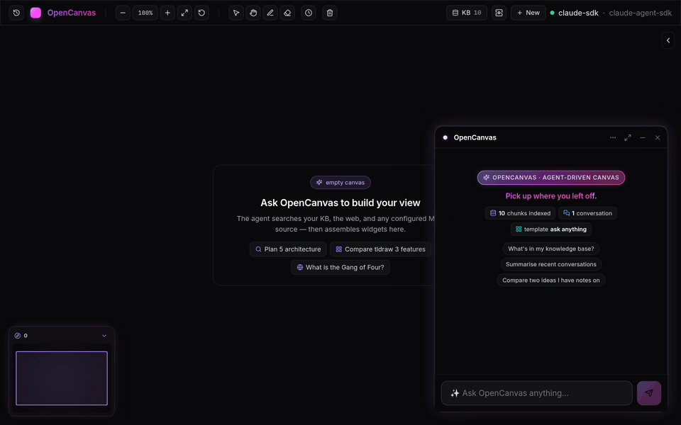

<div align="center">

# OpenCanvas

**An infinite canvas that the agent draws on.**

Ask anything → the agent searches your knowledge, the web, and your MCP servers → it places typed widgets on a tldraw canvas and replies with a short note pointing to what it built.

[]() []() []() []()



</div>

---

## In one paragraph

OpenCanvas is a local desktop knowledge surface. Conversations live alongside an infinite canvas where the agent renders **15 widget kinds** as it researches: markdown, code blocks, tables, timelines, file trees, kanban, tasks, sticky notes, composite cards, charts, calendars, clock/timer/stopwatch/pomodoro, web embeds, plugin-rendered iframes, and a generic universal-fallback widget. Every conversation auto-indexes into the same SQLite knowledge base, so the canvas gets smarter with use. Bring your own LLM (six providers, including Ollama for fully local), bring your own MCP servers, bring your own embedder. **Single-user, BYO-credentials, runs entirely on your machine.**

---

## Why it's different

| | Most chat apps | OpenCanvas |
|---|---|---|
| Output | One long stream of text | **Typed widgets on a canvas** — click, drag, pin, link, export |
| Memory | Per-message context window | **Self-improving KB** — every chat indexes back; old turns are searchable |
| Tools | A handful, baked in | **15 widget kinds + 12 tools + your MCP servers + runtime-registered plugins** |
| Sources | Chat-only | **MCP-native** — drop in any server (Confluence, Jira, filesystem, GitHub) |
| Drive | Chat input only | **REST API** — any process can render widgets via `POST /v1/canvas/*` |
| Memory of you | None | **Agent learns** — biases future placements toward kinds you've kept and pinned |

---

## 60-second tour

Once you have the app open (`pnpm electron:dev`), try these — each demonstrates a different axis:

```bash
# ── 1. Drop a chart from any terminal — full Vega-Lite spec
curl -s -X POST http://localhost:3457/v1/canvas/widgets \
  -H 'content-type: application/json' \
  -d '{
    "kind": "chart", "role": "primary",
    "payload": { "title": "Sample sales", "spec": {
      "data": {"values":[{"m":"Jan","s":28},{"m":"Feb","s":34},{"m":"Mar","s":42}]},
      "mark": {"type":"line","point":true},
      "encoding": {"x":{"field":"m","type":"ordinal"},"y":{"field":"s","type":"quantitative"}}
    }}}'

# ── 2. Embed any web page (sandboxed iframe + Open↗ escape hatch)
curl -s -X POST http://localhost:3457/v1/canvas/widgets \
  -H 'content-type: application/json' \
  -d '{"kind":"web-embed","role":"primary","payload":{"url":"https://news.ycombinator.com"}}'

# ── 3. A 25-min pomodoro that ticks live and auto-cycles
curl -s -X POST http://localhost:3457/v1/canvas/widgets \
  -H 'content-type: application/json' \
  -d "{\"kind\":\"time\",\"role\":\"primary\",\"payload\":{
    \"mode\":\"pomodoro\",\"label\":\"Focus 25/5\",\"startedAt\":$(date +%s)000,
    \"pomodoro\":{\"workSec\":1500,\"breakSec\":300,\"longBreakEvery\":4}
  }}"
```

In the chat: type `/embed https://en.wikipedia.org/wiki/Bitcoin` to drop a sandboxed Wikipedia widget. Press <kbd>⌘K</kbd> / <kbd>Ctrl K</kbd> for a palette that searches **every conversation's** widgets + slash commands + indexed messages. Drag a `.pdf` onto the window and the agent summarises it into widgets.

---

## Quick start

```bash
pnpm install
cp .env.example .env       # fill in keys you want (Anthropic / OpenAI / Tavily / Jira / …)
pnpm cli --probe           # health-check provider + embedder
pnpm electron:dev          # backend + Vite + Electron, all in one
```

Headless without Electron:

```bash
pnpm dev                   # backend on :3457, app on :3458 → http://127.0.0.1:3458
```

### Pick any LLM

OpenCanvas is **model-agnostic**. Six provider adapters ship out of the box; pick whichever matches your account or runs locally. Set the env var, switch by editing `~/.opencanvas/config.json` or pass `--profile <name>`:

| Provider | Config `llm.provider` | Auth | Notes |
|---|---|---|---|
| Claude Agent SDK | `claude-agent-sdk` | OAuth via Claude Code, or `ANTHROPIC_API_KEY` | In-process MCP — fastest agent loop |
| Anthropic direct | `anthropic-direct` | `ANTHROPIC_API_KEY` | Plain API; any Claude model |
| OpenAI | `openai` | `OPENAI_API_KEY` | GPT-4o, GPT-4.1, etc. |
| OpenRouter | `openrouter` | `OPENROUTER_API_KEY` | One key, hundreds of models incl. Llama, Mistral, DeepSeek |
| Ollama | `ollama` | none — local | Any model you've pulled (`llama3`, `qwen2.5-coder`, `gpt-oss`) |
| Sourcegraph Amp | `amp` | `AMP_API_KEY` | Agent loop with their hosted models |

```jsonc
// ~/.opencanvas/config.json — fully local
{
  "activeProfile": "local",
  "profiles": [{
    "name": "local",
    "llm":   { "provider": "ollama", "model": "llama3.1:8b", "baseUrl": "http://localhost:11434" },
    "embed": { "provider": "ollama", "model": "nomic-embed-text" },
    "sources": []
  }]
}
```

Embedders are pluggable too: bundled ONNX (`BAAI/bge-small-en-v1.5`, runs offline), OpenAI, Voyage, or Ollama.

### Web search

Set `TAVILY_API_KEY` in `.env` (free tier: 1000 searches/mo at <https://app.tavily.com>). Without it, `web_search` returns an explicit "not configured" error rather than failing silently.

### MCP sources

Add servers under `profiles[].sources` in your config. Works with any LLM provider — the agent calls them via tool-use whether it's Claude, GPT, Llama, or anything else:

```jsonc
{
  "sources": [{
    "id": "dev-fs",
    "name": "Development directory",
    "transport": "stdio",
    "command": "npx",
    "args": ["-y", "@modelcontextprotocol/server-filesystem", "/Users/me/Development"]
  }]
}
```

`pnpm cli --probe-sources` to verify. The agent calls them as `mcp__dev-fs__<tool>`.

---

## The catalog

### 15 widget kinds — all draggable, resizable, role-tinted, exportable

| Kind | Best for |
|---|---|
| `markdown` | Free-form prose with full GFM (tables, code, footnotes) |
| `code-block` | Syntax-highlighted snippets — language hint drives Shiki |
| `ticket` | Jira-style cards (id, status, assignee, priority, body) |
| `web-embed` | Any URL — sandboxed iframe with **Open ↗** escape hatch when sites block framing |
| `key-value-card` | Stat sheets / spec tables (per-row optional URL) |
| `table` | Real tables — sticky headers, per-column align/mono, clickable row links |
| `timeline` | Chronological events with kind tags + optional URLs |
| `file-tree` | Recursive FS view with expand/collapse + per-node URLs |
| `tasks` | Checklist with assignee/due/priority |
| `kanban` | Multi-column board (colored columns, draggable cards) |
| `sticky-note` | Yellow/pink/blue/green/violet/orange — quick captures |
| `composite` | One card with N typed sections |
| `time` | **Live clock / timer / stopwatch / pomodoro** — ticks on its own |
| `generic` | Universal fallback — Notion-style block composition (markdown / table / kv / embed / json) |
| `plugin` | **Runtime-registered** kinds — your iframe + JSON schema = a new widget kind |

### 12 agent tools (in-process MCP)

`search_kb`, `fetch_result`, `web_search`, `place_widget`, `stream_widget`, `update_widget`, `read_canvas`, `read_widget`, `focus_widget`, `link_widgets`, `clear_canvas`, `switch_template`. External MCP servers add their own (`mcp__<source-id>__<tool>`).

### Slash commands

Type `/` in chat to see the popover; <kbd>⌘K</kbd> finds them too.

| Command | Effect |
|---|---|
| `/team <prompt>` | 3-agent pipeline: Researcher → Builder → Critic, each phase sees the prior canvas |
| `/embed <url>` | Drop any URL as a sandboxed iframe widget |
| `/tidy` | Re-flow existing widgets into the active template's role slots |
| `/template <id>` | Switch active canvas template |
| `/summarize-selected` `/merge-selected` `/contrast-selected` `/rebuild-as-table` | Selection-scoped agent ops |
| `/pin-selected` `/unpin-selected` `/remove-selected` | Local widget ops over selection |
| `/export-png` `/export-md` | Download the canvas as PNG or Markdown |
| `/clear` | New conversation (current stays in History) |
| `/help` | List every command |

---

## Self-improving knowledge base

Every conversation auto-indexes into the same SQLite store as your docs/code. Old assistant turns become searchable via `search_kb`. The system gets smarter as you use it.

```bash
pnpm cli --index ./docs            # markdown / text → chunked + embedded
pnpm cli --index-code ./src        # .ts/.tsx/.js/.jsx → tree-sitter chunks + symbols
pnpm cli --search "<query>"        # hybrid BM25 + vector with RRF (k=60)
pnpm cli --storage-status          # path + size + table row counts
```

For richer multi-source projects (code + Jira + Confluence + Stash):

```bash
pnpm cli --kb-init my-svc --kb-root /path/to/repo
# edit ~/.opencanvas/config.json knowledgeBase.projects[] for jira/confluence/stash
pnpm cli --kb-ingest my-svc        # auto-enriches each chunk with 12 hypothetical user queries
pnpm cli --kb-status my-svc        # cursor + counts per source + per link type
```

Re-indexing is **idempotent** — re-running on unchanged content does zero LLM calls (the QA enricher caches per-chunk via SHA-256).

### Agent memory

Each conversation tracks how you respond to placed widgets — kinds you keep, pin, or dismiss. The next chat turn includes a hint in the system prompt:

```
User preferences:
- Preferred: chart (score 8), table (score 4), markdown (score 3)
- Often dismissed: ticket (4 dismissals), kanban (2 dismissals)
```

Score = `placed + 2 × pinned − deleted`. The agent biases future placements toward kinds you actually use. Per-conversation, persisted to localStorage, no remote tracking.

---

## `/v1/canvas/*` — drive the canvas from any process

Any local process can render widgets on a running OpenCanvas instance. The browser keeps a long-lived SSE open to `/v1/canvas/events`; external `POST`s push directives into the per-conversation event bus, which fans out to every connected tab.

**Auth.** Optional. Set `OPENCANVAS_API_KEY` to require `Authorization: Bearer <key>`. Unset → no auth (localhost-only dev default).

```
POST   /v1/canvas/widgets                  → { id, directive }
PATCH  /v1/canvas/widgets/:id              { payload? | appendSections? }
POST   /v1/canvas/widgets/:id/focus
DELETE /v1/canvas/widgets/:id
POST   /v1/canvas/clear
POST   /v1/canvas/links                    { fromId, toId, label? } → { linkId }
POST   /v1/canvas/template                 { id }
GET    /v1/canvas/snapshot                 → { activeTemplateId, widgets[] }

POST   /v1/canvas/streams                  → { id }                   # open a streaming widget
POST   /v1/canvas/streams/:id/ops          { ops: WidgetStreamOp[] }  # append text / rows / fields
POST   /v1/canvas/streams/:id/end          { ok, error? }
POST   /v1/canvas/streams/:id/cancel

POST   /v1/canvas/widget-kinds             { kind, label, description, renderer }
DELETE /v1/canvas/widget-kinds/:kind
GET    /v1/canvas/widget-kinds             → { kinds: [...] }

POST   /v1/canvas/refresh/register         { widgetId, policy }       # live data refresh
POST   /v1/canvas/refresh/unregister       { widgetId }

POST   /v1/canvas/upload                   multipart/form-data        # PDF / docx / xlsx
GET    /v1/canvas/events?conversationId    # SSE — directives stream to the browser
```

Unknown kinds and malformed payloads auto-classify into a `generic` widget — the response surfaces what was reformatted.

### Stream a long answer from Python

```python
import requests
BASE = "http://localhost:3457/v1/canvas"

r = requests.post(f"{BASE}/streams", json={
    "kind": "generic", "role": "primary",
    "scaffold": {"title": "Streaming from Python",
                 "blocks": [{"type": "markdown", "content": ""}]}}).json()
wid = r["id"]

for paragraph in long_answer_generator():
    requests.post(f"{BASE}/streams/{wid}/ops", json={
        "ops": [{"kind": "append-text", "blockIndex": 0, "text": paragraph + "\n\n"}]})

requests.post(f"{BASE}/streams/{wid}/end", json={"ok": True})
```

### Register a custom widget kind

```bash
curl -s -X POST http://localhost:3457/v1/canvas/widget-kinds \
  -H 'content-type: application/json' \
  -d '{
    "kind": "weather-card",
    "label": "Weather",
    "description": "Current temp + 3-day forecast for a city",
    "renderer": {
      "type": "iframe",
      "srcdoc": "<!doctype html><body><div id=app></div><script>const p=window.opencanvas.props;document.getElementById(\"app\").textContent=p.city+\": \"+p.temp+\"°\"</script></body>",
      "defaultSize": { "w": 280, "h": 160 }
    }
  }'
```

The agent's `place_widget` tool now lists `weather-card` as an available kind. Ask in chat: *"add a weather widget for Tokyo"* and the agent calls `place_widget(kind: 'weather-card', ...)` directly.

---

## Architecture

```
┌────────────────────────┐                ┌─────────────────────────┐
│  Vite + React + tldraw │   /v1/chat     │  Hono backend           │
│  app on :3458          │ ─────────────→ │  (provider abstraction) │
│                        │   /v1/team     │                         │
│  • Floating chat       │ ─────────────→ │  LLMProvider adapter    │
│  • tldraw canvas       │                │  (Claude / GPT /        │
│  • Conversations       │                │   Llama / Ollama / …)   │
│  • Sources panel       │ ←─── UIMS ──── │       │                 │
│  • ⌘K palette          │                │       ▼                 │
│  • History scrubber    │                │  12 in-process tools    │
│                        │ ←─── SSE ───── │  + external MCP servers │
│                        │  /v1/canvas/   │  + plugin registry      │
└────────────────────────┘    events      │       │                 │
                                          │       ▼                 │
                                          │  SQLite + sqlite-vec    │
                                          │  (chunks + embeddings)  │
                                          └─────────────────────────┘
```

**Backend** (`src/`): Hono routes (`/v1/chat`, `/v1/team`, `/v1/canvas/*`, `/v1/search`, `/v1/index-conversation`, `/v1/sources/list`, `/v1/health`, …). The `LLMProvider` interface is a thin streaming contract; six adapters implement it (Claude SDK, Anthropic direct, OpenAI, OpenRouter, Ollama, Sourcegraph Amp), and adding a seventh is one file. `SearchService` is hybrid BM25 + sqlite-vec with reciprocal rank fusion (k=60). KB pipeline owns chunking + QA enrichment + per-project source state. The plugin registry lets external processes ship runtime-registered widget kinds via iframe srcdoc + postMessage prop bridge.

**Frontend** (`app/`): tldraw 3 with custom shape utils for each widget kind. Zustand stores for conversations, templates, canvas stats, preferences, history. AI SDK 6 `useChat` for chat streaming over the UI Message Stream protocol; live tool events drive the canvas dispatcher. The dispatcher coalesces streaming ops per animation frame, debounces auto-tidy, and routes between built-in kinds and registered plugins.

---

## Development

```bash
pnpm test                                          # backend (vitest, Node)
pnpm exec vitest run --config app/vite.config.ts   # frontend (vitest + jsdom)
pnpm typecheck                                     # tsc --noEmit (root)
pnpm exec tsc --noEmit -p app/tsconfig.json        # tsc (app)

pnpm dev                                           # backend + Vite (no Electron)
pnpm electron:dev                                  # backend + Vite + Electron desktop
pnpm dist:linux                                    # build installer (mac / win / linux)
```

The dev backend uses `tsx` (no watcher). Backend changes need a `pnpm dev` restart; Vite HMRs the frontend.

### Project layout

```
src/                                # backend (Node, ESM)
  agent/                            # tools/, payloads.ts, types.ts, classifier.ts
  backend/                          # Hono app + routes/ + widget-registry + canvas-event-bus
  config/                           # ~/.opencanvas/config.json loader + zod schema
  connectors/                       # code, jira, stash, confluence
  embedders/                        # bundled-onnx, openai, voyage, ollama
  indexer/                          # orchestrator, chunker, qa-enricher, link-extractor
  kb/                               # cli-commands, export
  mcp/                              # transport, source registry
  providers/                        # claude-agent-sdk, anthropic-direct, openai, ollama, …
  search/                           # FTS5 + sqlite-vec hybrid + RRF
  storage/                          # SQLite open + migrations
  walk/                             # source-files
  web/                              # tavily

app/                                # frontend (Vite + React 19 + tldraw 3)
  src/
    canvas/                         # Tldraw setup + 15 shape utils + dispatcher
    components/                     # Chat, FloatingChat, CommandPalette, HistoryScrubber, …
    state/                          # zustand stores (conversations, preferences, history, …)
    styles/globals.css              # design tokens + chrome

electron/main.cjs                   # Electron wrapper
docs/                               # demo gif + historical specs
```

---

## Status

**Experimental.** Single-user, BYO credentials, runs entirely on your machine. The only outbound calls are to your chosen LLM provider, the embedder if you use OpenAI / Voyage, Tavily for web search, any MCP servers you configure, and CDNs for plugin widgets that load external libraries (Vega-Lite for charts, etc.).

450+ tests passing across backend (311) and frontend (139) — every widget kind, every tool, the agent classifier, the streaming protocol, the plugin registry, the preference scoring, the canvas event bus.
