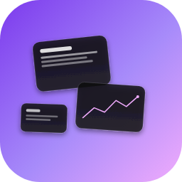
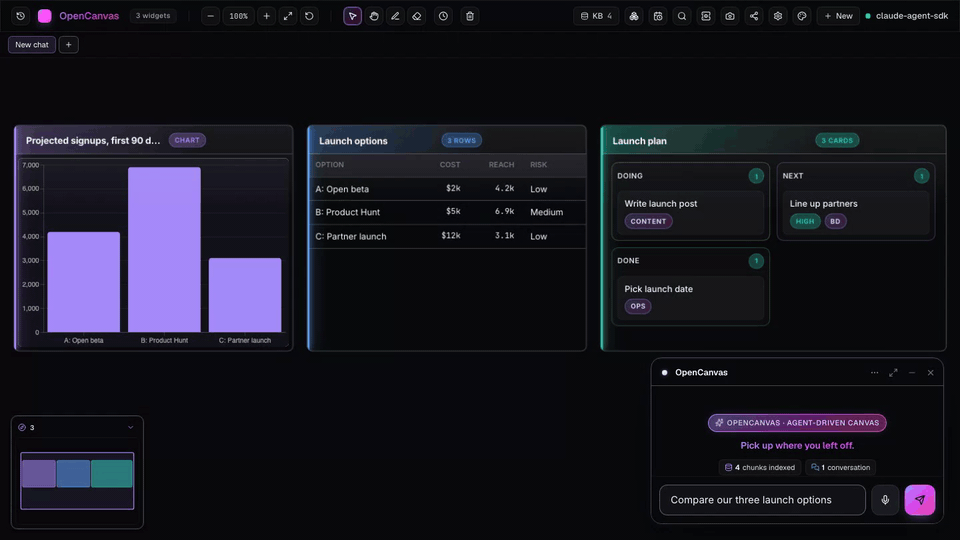

<div align="center">



# OpenCanvas

### An infinite canvas your LLM draws on.

Ask anything. The agent renders **typed widgets** on a tldraw canvas — markdown, charts, kanbans, code, tables, web embeds, sandboxed plugins. Every conversation indexes back into a local SQLite KB so the canvas gets smarter with use.

**BYO model · MCP-native · Local-first · MIT**

[](https://github.com/ashark-ai-05/opencanvas/actions/workflows/ci.yml) []() []() [](./LICENSE) [](./SECURITY.md)



🌐 **[ashark-ai-05.github.io/opencanvas](https://ashark-ai-05.github.io/opencanvas/)** &nbsp;·&nbsp; 📺 [1-minute walkthrough](docs/demo.mp4) &nbsp;·&nbsp; 📡 [Live API reference](https://ashark-ai-05.github.io/opencanvas/api.html)

**[Install](#install) · [Why](#why-its-different) · [Pick a model](#pick-any-llm) · [REST API](#drive-it-from-any-process) · [Security](./SECURITY.md)**

</div>

---

## Install

```bash
git clone https://github.com/ashark-ai-05/opencanvas.git
cd opencanvas
pnpm install
cp .env.example .env       # at least one provider key
pnpm electron:dev          # backend + Vite + Electron, one command
```

Headless without Electron: `pnpm dev` → http://127.0.0.1:3458

> Packaged installers (`.dmg` / `.exe` / `.AppImage`) ship via the [Releases tab](https://github.com/ashark-ai-05/opencanvas/releases). Want to host a public demo? See [docs/deploy-railway.md](./docs/deploy-railway.md) — Railway + Groq Llama 3.1 70B, ~10 minutes.

---

## Why it's different

|   | Most chat apps | **OpenCanvas** |
|---|---|---|
| **Output** | A long stream of text | Typed widgets on a canvas — click, drag, pin, link, export |
| **Memory** | Per-message context window | Self-improving SQLite KB; every chat is searchable across conversations |
| **Tools** | A handful, baked in | 15 widget kinds + 12 agent tools + your MCP servers + runtime plugins |
| **Sources** | Chat-only | MCP-native — any server (Confluence, Jira, filesystem, GitHub, …) |
| **Drive** | Chat input only | REST API — any local process can render widgets via `POST /v1/canvas/*` |
| **Privacy** | Cloud round-trips | Single-user, BYO credentials, runs entirely on your machine |

---

## Pick any LLM

Every provider gets the **same agent** — same tools, same widget surface,
same UX. The model is a config switch:

| Provider | Auth | Notes |
|---|---|---|
| **Anthropic** | `ANTHROPIC_API_KEY` | Claude Sonnet/Opus 4+; extended thinking auto-on |
| **OpenAI** | `OPENAI_API_KEY` | GPT-4o, GPT-4.1, o-series |
| **Google Gemini** | `GOOGLE_API_KEY` | Gemini 2.5/3.x Flash & Pro; thinking surfaces in the chat |
| **Groq** | `GROQ_API_KEY` | Llama / Mixtral / Kimi at Groq speeds |
| **OpenRouter** | `OPENROUTER_API_KEY` | One key, hundreds of models |
| **Ollama** | _none — local_ | Any model you've pulled (`llama3.2`, `qwen2.5-coder`, …) |
| **Sourcegraph Amp** | `AMP_API_KEY` | Hosted agent loop (legacy path) |

Tool calling is driven by the [Vercel AI SDK](https://ai-sdk.dev/), so any
provider with function-calling support works the same way. See
[`docs/plans/unified-agent.md`](./docs/plans/unified-agent.md) for the
architecture.

Embedders are pluggable too: bundled ONNX (runs offline), OpenAI, Voyage, or Ollama.

<details>
<summary>Fully-local config example</summary>

```jsonc
// ~/.opencanvas/config.json
{
  "activeProfile": "local",
  "profiles": [{
    "name": "local",
    "llm":   { "provider": "ollama", "model": "llama3.1:8b" },
    "embed": { "provider": "ollama", "model": "nomic-embed-text" },
    "sources": []
  }]
}
```
</details>

---

## The widget catalog

**15 kinds.** Markdown · code blocks · tables · timelines · file trees · kanban · tasks · sticky notes · composite cards · charts (Vega-Lite) · calendars · clock/timer/stopwatch/pomodoro · web embeds (sandboxed iframes) · plugin-rendered iframes · generic fallback.

Every widget is a **typed contract** — Zod schema for props + a React component. Add a new kind without retraining anything.

**Runtime plugins.** The agent can call `register_widget_kind` mid-conversation to declare a new widget on the fly. Ships with a Python REPL (Pyodide) and a JS REPL example. Plugin iframes run with `sandbox="allow-scripts"`, no `allow-same-origin` — null origin, no parent DOM access.

---

## MCP-native

Add any MCP server under `profiles[].sources` — works with any LLM provider:

```jsonc
{
  "sources": [{
    "id": "dev-fs",
    "transport": "stdio",
    "command": "npx",
    "args": ["-y", "@modelcontextprotocol/server-filesystem", "/Users/me/Development"]
  }]
}
```

`pnpm cli --probe-sources` to verify. The agent invokes them as `mcp__dev-fs__<tool>`.

---

## Drive it from any process

Any local process — cron jobs, watchers, scripts — can render widgets. The browser keeps an SSE connection open to `/v1/canvas/events`; external `POST`s push directives into the per-conversation event bus.

```bash
# Place a Vega-Lite chart from your terminal
curl -X POST http://127.0.0.1:3457/v1/canvas/widgets \
  -H 'content-type: application/json' \
  -H "x-opencanvas-token: $(cat ~/.opencanvas/auth-token)" \
  -d '{"kind":"chart","role":"primary","payload":{"title":"Sales","spec":{...}}}'
```

**Full REST reference**: browse the [live API docs](https://ashark-ai-05.github.io/opencanvas/api.html) (Scalar / Swagger UI), or read the raw [OpenAPI 3.1 spec](./docs/openapi.yaml). When the backend is running, the same UI is served at `http://127.0.0.1:3457/docs`.

**Auth.** A 256-bit token is generated on first run and persisted to `~/.opencanvas/auth-token` (mode `0600`). Required on state-mutating routes. See [SECURITY.md](./SECURITY.md).

---

## Self-improving KB

Every conversation auto-indexes into the same SQLite + sqlite-vec store as your docs and code. Old turns become searchable via `search_kb`. Hybrid BM25 + vector retrieval. Idempotent re-indexing — re-running on unchanged content costs zero LLM calls.

```bash
pnpm cli --index ./docs            # markdown / text → chunks + embeddings
pnpm cli --index-code ./src        # tree-sitter chunks + symbols
pnpm cli --search "<query>"        # hybrid search
```

The agent also learns *you* — kinds you keep + pin score higher; kinds you dismiss bias the next placement away. Per-conversation, persisted locally, no remote tracking.

---

## Architecture

```
┌────────────────────┐                ┌─────────────────────────┐
│  Vite + React +    │   /v1/chat     │  Hono backend           │
│  tldraw            │ ─────────────→ │                         │
│  • floating chat   │                │  6 LLM adapters         │
│  • canvas          │                │  12 in-process tools    │
│  • palette ⌘K      │ ←── SSE ────── │  + external MCP servers │
│  • history         │  /v1/canvas/   │  + plugin registry      │
└────────────────────┘    events      │       │                 │
                                      │       ▼                 │
                                      │  SQLite + sqlite-vec    │
                                      └─────────────────────────┘
```

tldraw v3 with one shape util per widget kind. Zustand for app state. AI SDK 6 for chat streaming. Hono + better-sqlite3 + sqlite-vec on the backend. Electron wrapper for the desktop install.

---

## Development

```bash
pnpm test                                          # backend (vitest, Node)
pnpm vitest run --config app/vite.config.ts        # frontend (vitest + jsdom)
pnpm typecheck                                     # tsc --noEmit
pnpm app:build                                     # production bundle
pnpm dist                                          # electron-builder installer
```

**596 tests passing** · 383 backend, 213 frontend.

---

## Status

Experimental. Solo project, MIT. No telemetry, no remote services unless you point it at one.

Issues + PRs welcome. See [CONTRIBUTING.md](./CONTRIBUTING.md). For security issues, [SECURITY.md](./SECURITY.md).
